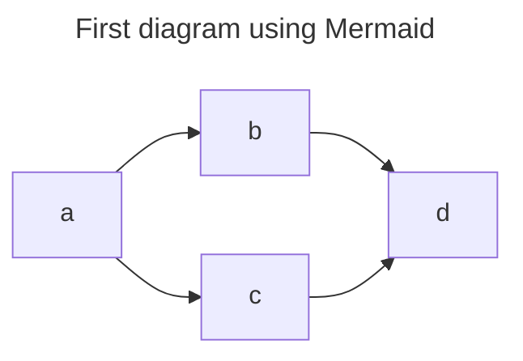

Power of being able to turn words and thoughts into diagrams

Many engineers underestimate power of diagram (conveying their ideas and thoughts and its ability to further your career)

Document your domain
First create domain model
Domain modeling is the primary way of determining the important aspects of a business.

Created collaboratively by engineering, product, and business stakeholders to ensure all major parts of the business are aligned on what the domain model looks like.
Determine the Important Entities
Document Our First Relationship
Define Associations
Define Composite Relationships
Define Aggregate Relationships
Decide Between Association, Aggregation, and Composition
## Document Your Own Domain
## What You’ve Learned
# Enhance Your Domain Model
## Define Inheritance
## Describe Relationships
## Add Multiplicity
## Add a Title
## Improve Readability
## Enrich Nodes with Links
## Enhance Your Domain Model
## What You’ve Learned
# Visualize Application and User Flows
## Define Actors and Participants
## Add Our First Interaction
## Show Branching Logic
## Display Asynchronous Messages
## Display Length of Interactions with Activations
## Add Additional Information with Notes
## Annotate Your Diagram with Sequence Numbers
## Create Dropdown Menus
## Visualize Your Own Application Flow
## What You’ve Learned
# Model Your Architecture
## Using the C4 Model
## Creating a System Context Diagram
## Add Nodes
## Connect Nodes
## Add Some Style
## Create Your Own System Context Diagram
## What You’ve Learned
# Detail Your System’s Containers
## Define the First Two Containers
## Create Clear Boundaries with Subgraphs
## Add Supporting Systems
## Improve Readability with Link Lengths
## Display Asynchronous Interactions
## Additional Arrow Types
## Create Your Own Container Diagram
## What You’ve Learned
# Structure Your Components and Code
## Code Diagram
## Leverage Flowcharts for Complex Flows
## What You’ve Learned
# Design Database Schemas
## Use Entity Relationship Diagrams
## Define Our First Entity
## Relate Entities
## Add Zero-to-Many Relationships
## Enrich Schemas with Keys
## Comment Your Columns
## Define Zero-or-One Relationships
## Describe Non-identifying Relationships
## Finalize Streamy’s ERD
## Design Your Database Schema
## What You’ve Learned
# Visualize Code Flows
## Use Sequence Diagrams to Understand Class Interactions
## Define Loops
## Show Parallel Processes
## What You’ve Learned
# Design and Refactor Your Applications
## Define Classes
## Show Dependencies with Relationships
## Refactor the Classes
## Introduce a Request Class
## Define Interfaces
## Create a Class Diagram
## What You’ve Learned
# Render Diagrams Using Native Support
## Leverage Native Mermaid Integrations
## Render Mermaid Within Markdown Files
## Where Should You Include Diagrams?
## What About Websites Without Native Support?
## Keep Diagrams Up-to-Date
## Render a Diagram on GitHub
## What You’ve Learned
# Create a Static Site with Mermaid Diagrams
## Devise a Plan of Action
## Learn the Basics of a GitHub Action
## Start by Defining the Events That Trigger the Action
## Check Out the Repository’s Code
## Convert Mermaid Markup to SVGs in Markdown
## Build Jekyll Artifacts
## Deploy to GitHub Pages
## Run the Action
## Render Diagrams on Page Load
## What You’ve Learned
# What You’ve Learned