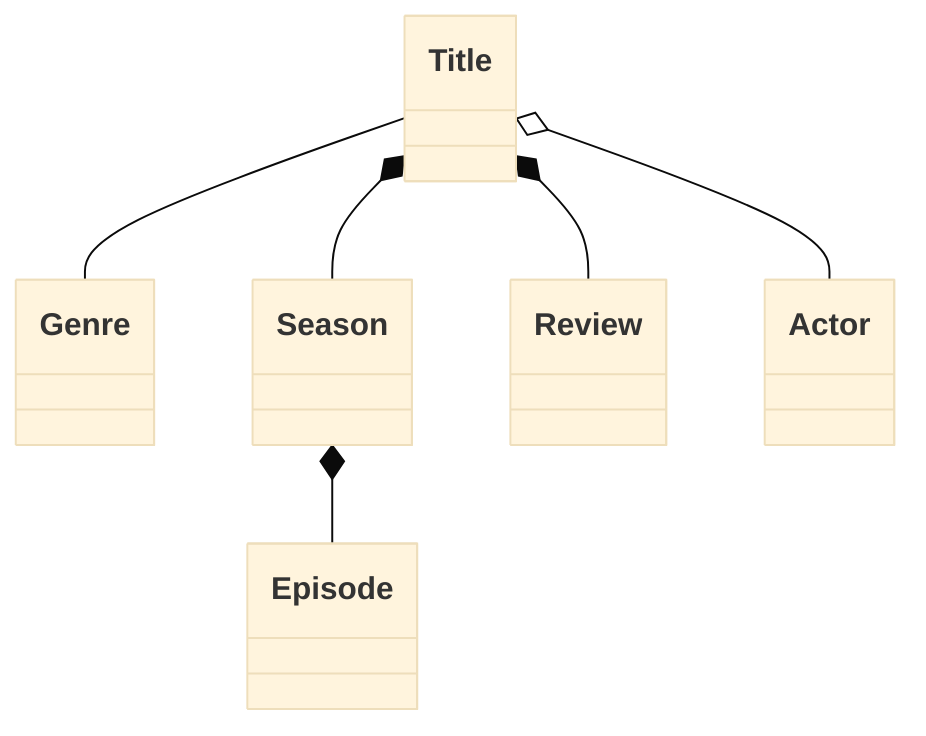
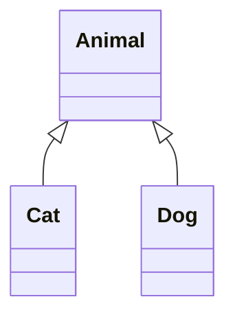

# Relationship Diagram

## Compositions
- Tightly related
- Parent Child relationship
- Cannot exist independently
## Aggregate
- Bond is not as strong as composition
- Parent Child relationship
- Child can still exist 
## Associations
- Loosely related
- Exist independent
## Consider
>Benefit of domain modelling
>It aligns everyone to the same constructs

> No real right or wrong
>> Base on mutual understanding
# Inheritance Diagram
